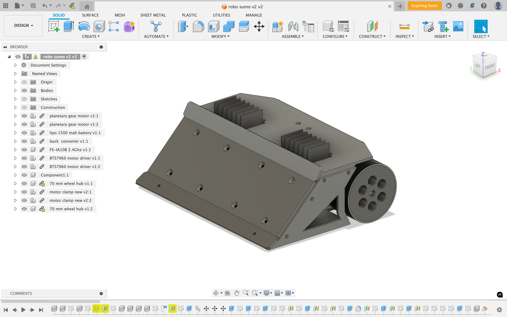
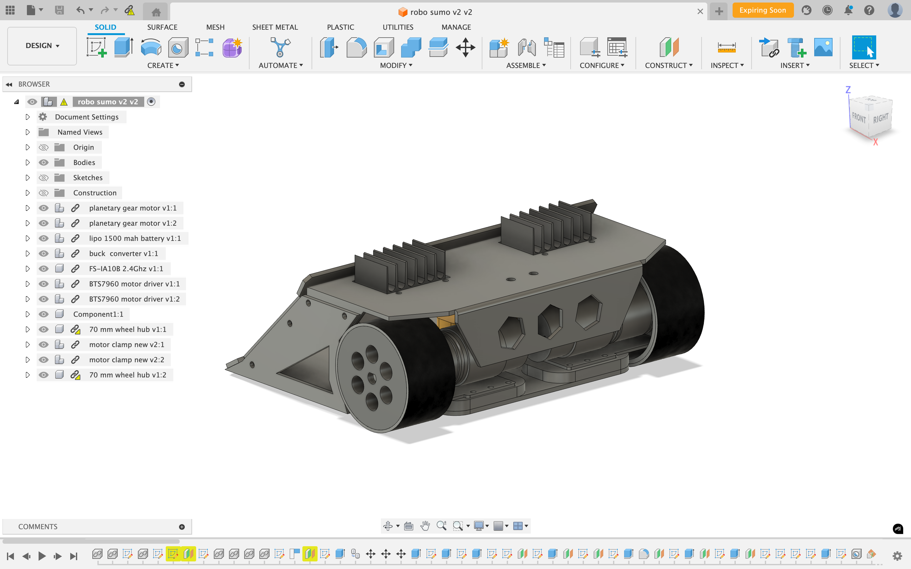
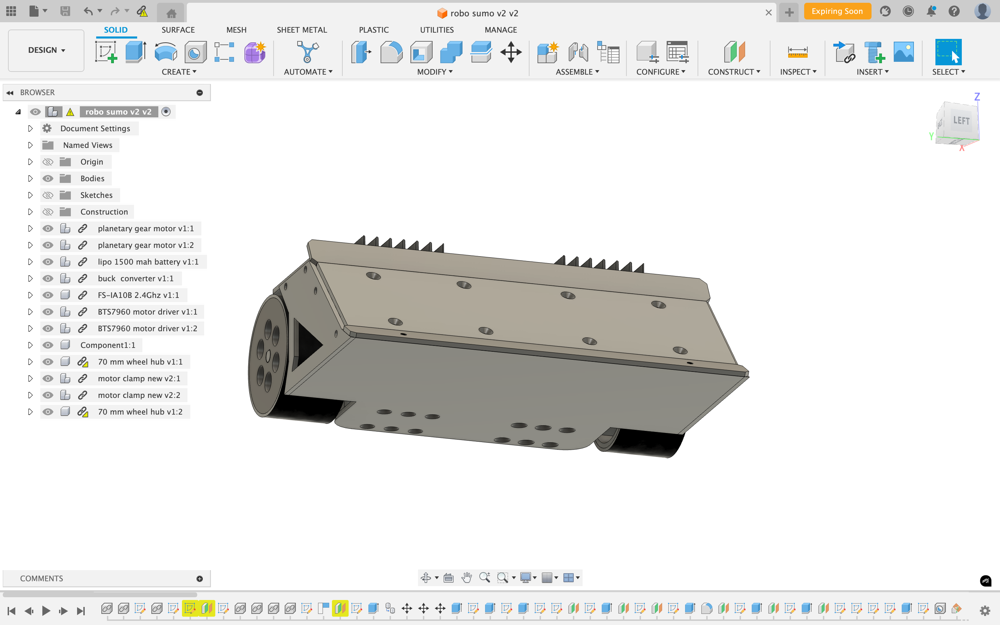
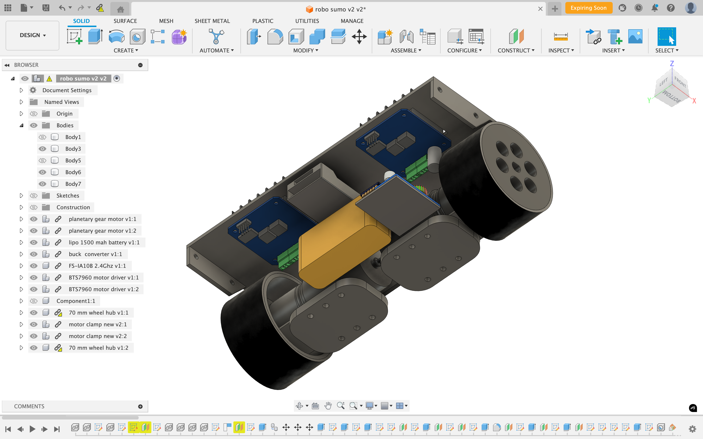
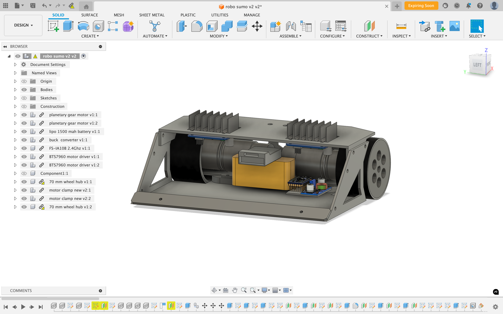
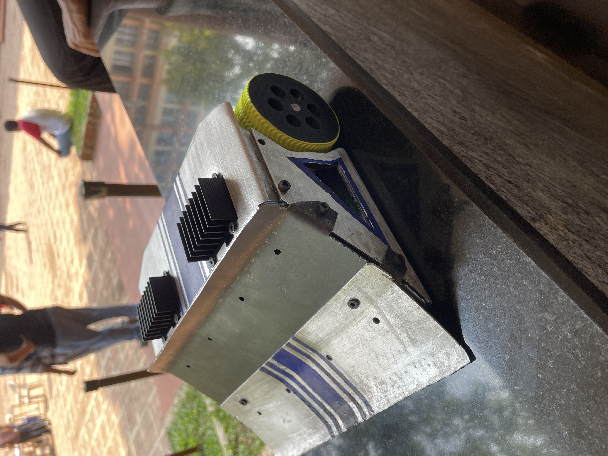

# Sumo Robot

A manually controlled sumo robot designed and built from the ground up — covering mechanical design, custom electronics, and embedded firmware.

## 🛠 Project Overview

- **Sheet metal chassis** designed using Fusion 360  
- **Custom circuit board** for motor control and wireless communication  
- **Firmware** written in C/C++ for low-latency, real-time control  
- **Manually operated** via wireless interface

---

## 🧩 CAD Design (Fusion 360)

### 🔹 CAD – Front View  

### 🔹 CAD – Back View  

### 🔹 CAD – Down View  

### 🔹 CAD – Electronics Layer  

### 🔹 CAD – Wedge Removed  

---

## 🖼️ Real-World Robot Gallery

### 🔹 Sumo Robot  

---

## 🎥 Test Footage

Watch the robot in action:

- [▶️ Test Drive 1 (YouTube Short)](https://youtube.com/shorts/tEQeGx0Dwz8?feature=share)  
- [▶️ Test Drive 2 (YouTube Short)](https://youtube.com/shorts/XdukFN9LFL8?feature=share)

---

## 🧰 Tech Stack

- **Fusion 360** – Mechanical design  
- **Custom PCB** – Circuit design and motor driver integration  
- **C/C++** – Embedded firmware  
- **Linux, PlatformIO/Arduino IDE** – Development environment  
- **Manual wireless control** – (Flysky FS-GT2 2.4GHz 2-channel transmitter/receiver)

---

## 🤝 Contact

For questions, collaboration, or feedback, feel free to reach out or open an issue in this repo.

