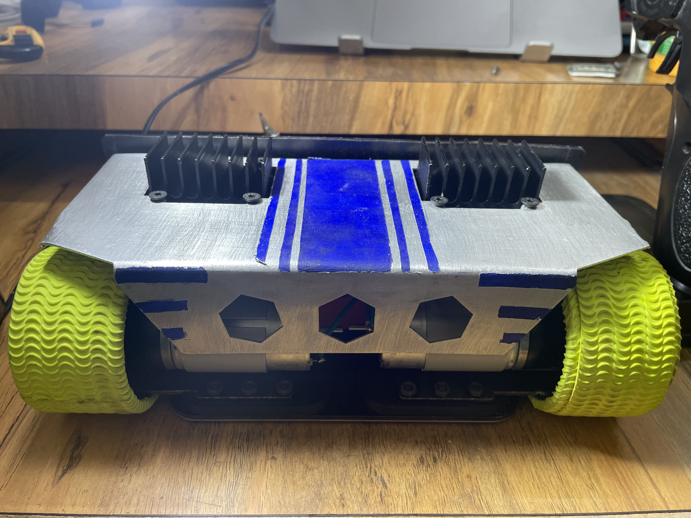
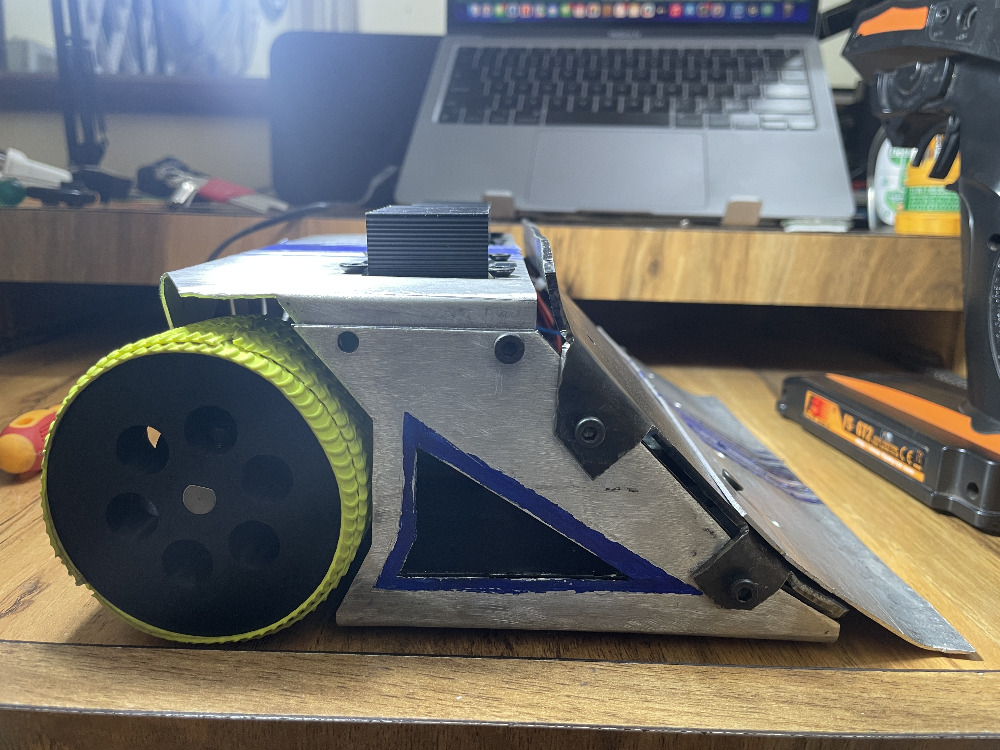
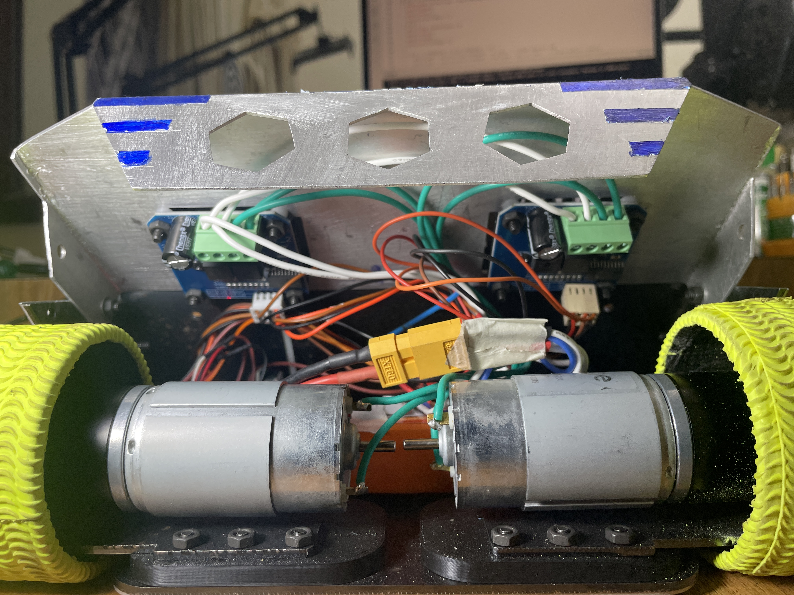
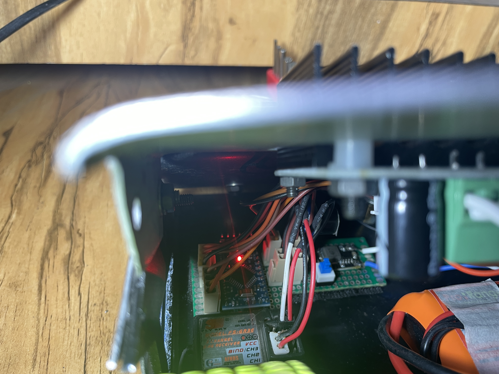
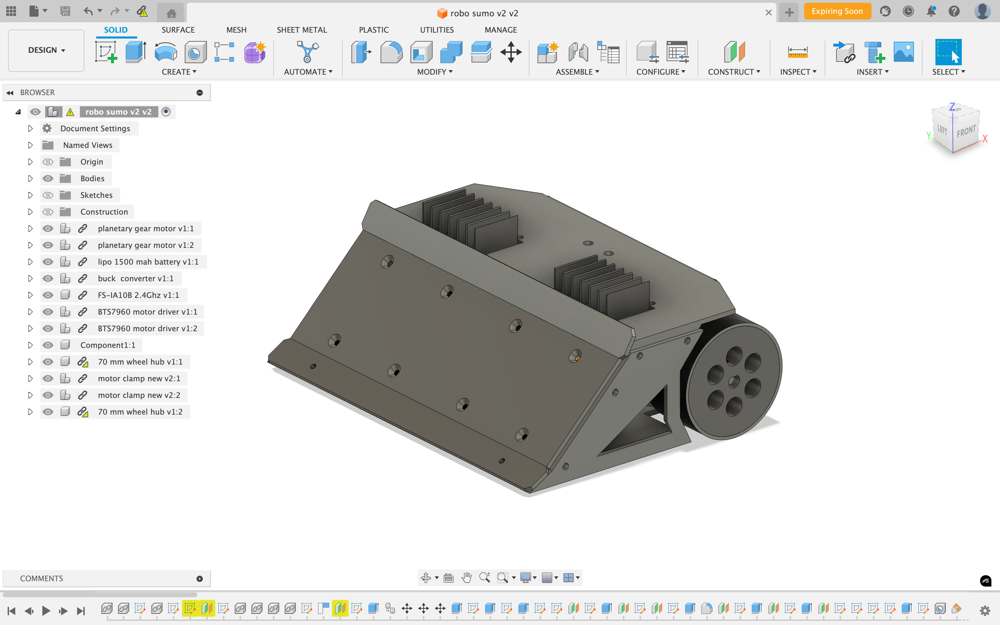
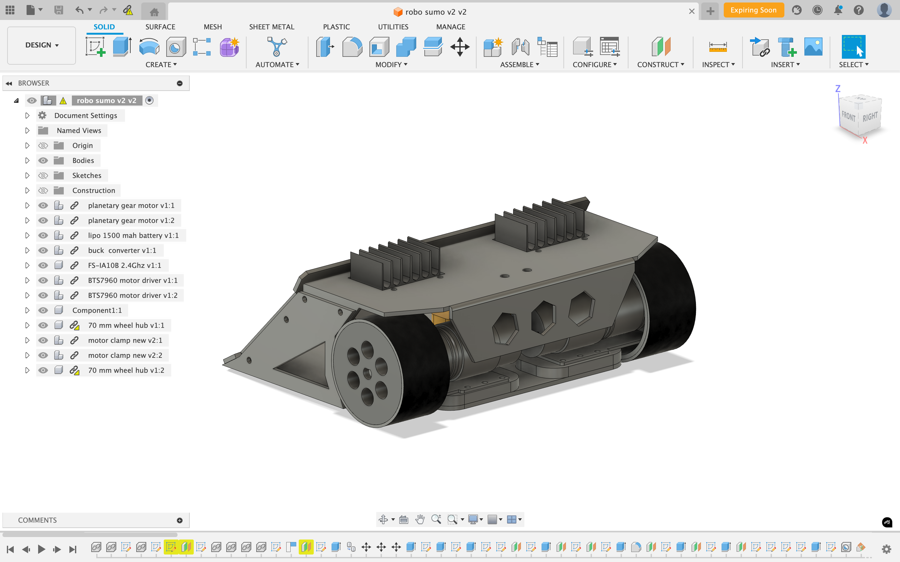
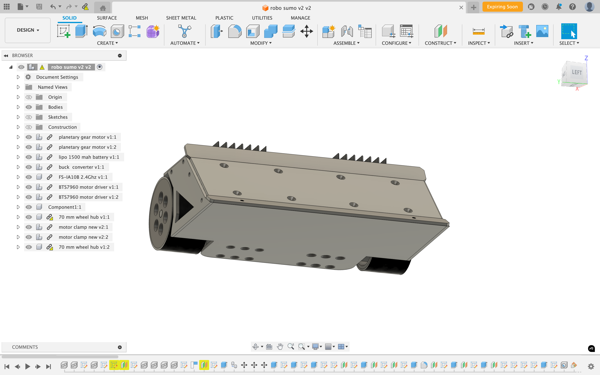
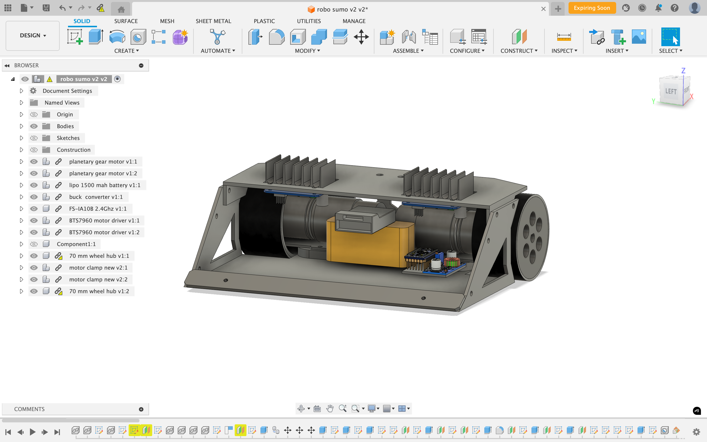
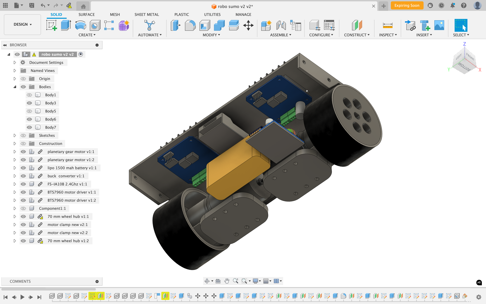

# Sumo Robot

A manually controlled sumo robot designed and built from the ground up — covering mechanical design, custom electronics, and embedded firmware.

## 🛠 Project Overview

- **Sheet metal chassis** designed using Fusion 360
- **Custom circuit board** for motor control and wireless communication
- **Firmware** written in C/C++ for low-latency, real-time control
- **Manually operated** via wireless interface

---

## 🖼️ Real-World Robot Gallery

### General Views
- 
- 
- 
- 
- 

### Components
- 
- 
- 

---

## 🧩 CAD Design (Fusion 360)

- 
- 
- 
- 
- 

---

## 🎥 Test Footage

- [▶️ Test Drive (MP4)](sumo-bot-test-drive.MP4)
- [▶️ Full Test (MOV)](sumo-bot-test.MOV)

---

## 🧰 Tech Stack

- **Fusion 360** – Mechanical design  
- **Custom PCB** – Circuit design and motor driver integration  
- **C/C++** – Embedded firmware  
- **Linux, PlatformIO/Arduino IDE** – Development environment  
- **Manual wireless control** – (Flysky FS-GT2 2.4Ghz 2 channel transmitter and receiver)

---

## 🤝 Contact

For questions, collaboration, or feedback, feel free to reach out or open an issue in this repo.

