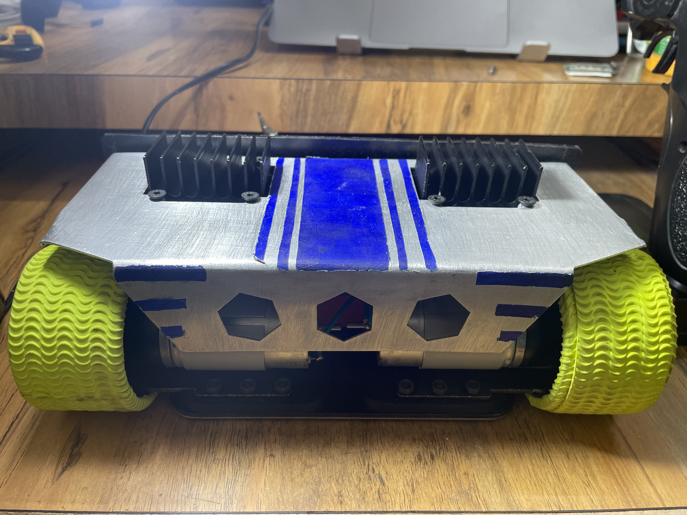
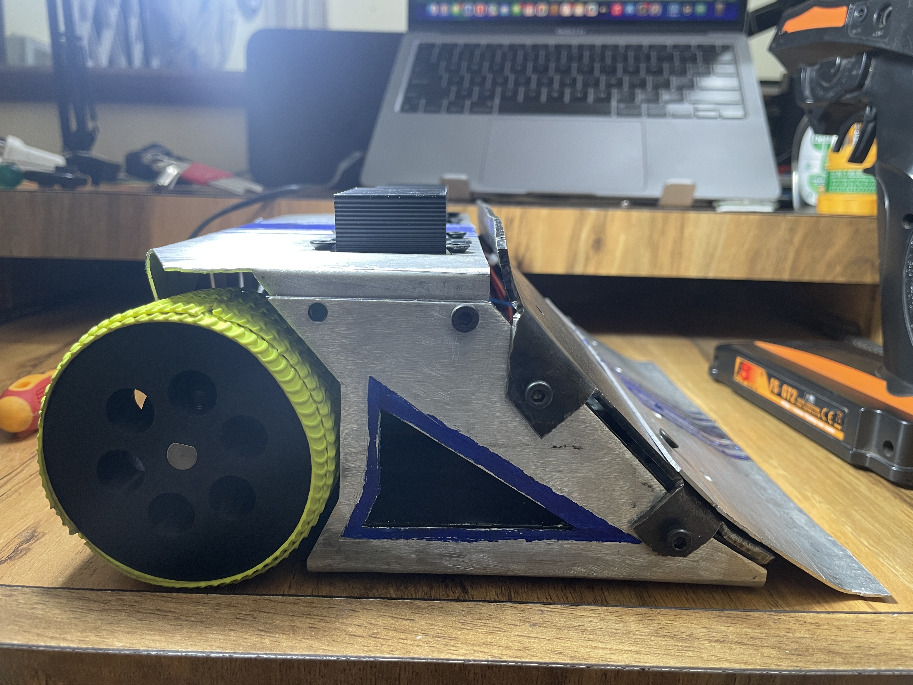
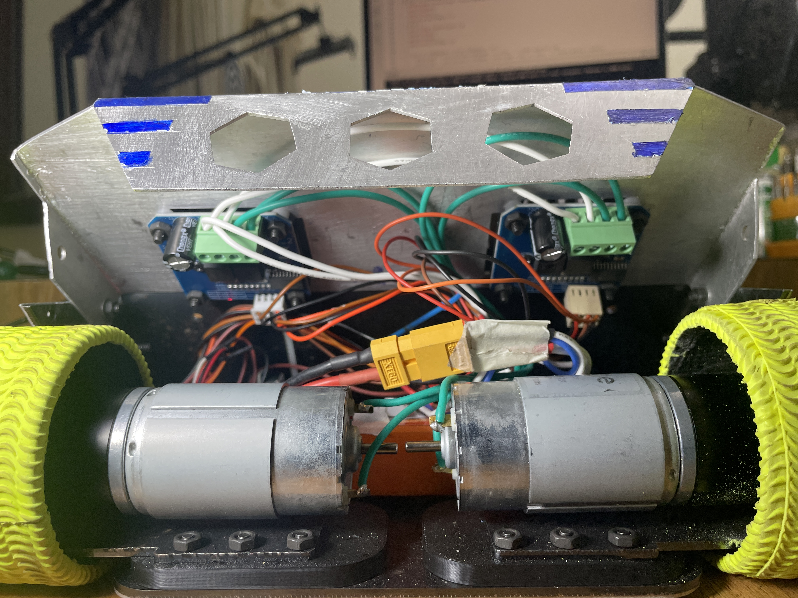
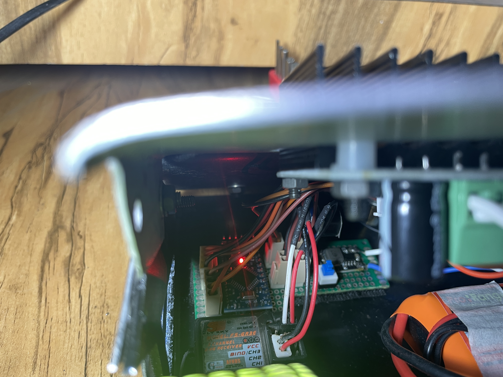

# Manual Sumo Robot

A manually controlled sumo robot designed and built from the ground up — covering mechanical design, custom electronics, and embedded firmware.

## 🛠 Project Overview

- **Sheet metal chassis** designed using Fusion 360  
- **Custom circuit board** for motor control and wireless communication  
- **Firmware** written in C/C++ for low-latency, real-time control  
- **Manually operated** via wireless interface

---

## 🖼️ Real-World Robot Gallery

### 🔹 Front View

### 🔹 Rear View

### 🔹 Side View

### 🔹 Top View

### 🔹 Angled View

### 🔹 Electronics Overview

### 🔹 Circuit Close-Up

### 🔹 Caster Wheel

---

## 🧩 CAD Design (Fusion 360)

### 🔹 CAD – Front View

### 🔹 CAD – Back View

### 🔹 CAD – Down View

### 🔹 CAD – Electronics Layer

### 🔹 CAD – Wedge Removed

---

## 🎥 Test Footage

⚠️ *Note: GitHub does not support inline video playback for `.mp4` or `.mov` files. Click below to download or open them in your browser.*

- [📹 Test Drive (MP4)](media/sumo-bot-test-drive.MP4)  
- [📹 Full Test (MOV)](media/sumo-bot-test.MOV)

---

## 🧰 Tech Stack

- **Fusion 360** – Mechanical design  
- **Custom PCB** – Circuit design and motor driver integration  
- **C/C++** – Embedded firmware  
- **Linux, PlatformIO/Arduino IDE** – Development environment  
- **Manual wireless control** – (Bluetooth/RF depending on your setup)

---

## 🤝 Contact

For questions, collaboration, or feedback, feel free to reach out or open an issue in this repo.
